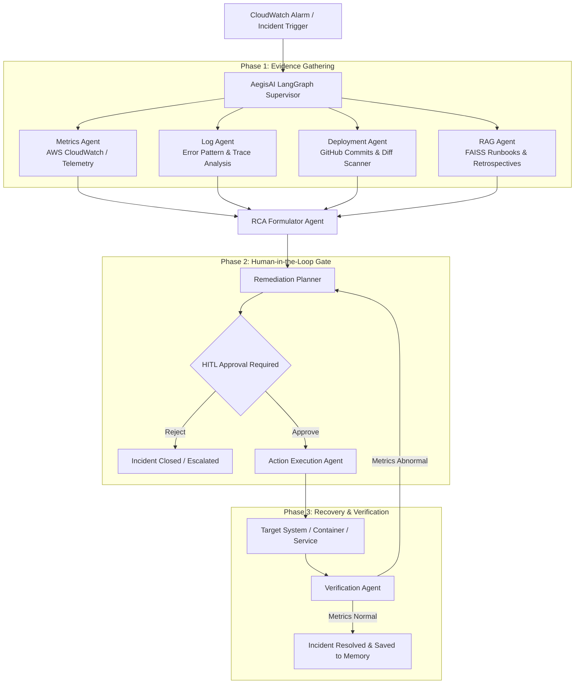

# AegisAI (AGIS-AI) 🛡️

> **Autonomous Cloud Incident Response & Root-Cause Analysis Platform**  
> Powered by **LangGraph**, **LangChain**, and Multi-Agent Orchestration with Human-in-the-Loop Safeguards.

[](https://www.python.org/)
[](https://fastapi.tiangolo.com/)
[](https://github.com/langchain-ai/langgraph)
[](LICENSE)

---

## 📖 Overview

**AegisAI** is an intelligent, autonomous Site Reliability Engineering (SRE) assistant designed to triage, investigate, diagnose, and remediate cloud production incidents in real time. 

When an outage, memory leak, or latency spike occurs, AegisAI dispatches specialized AI agents across telemetry streams, log aggregation systems, source control, and historical runbooks to perform deep Root-Cause Analysis (RCA). Before executing any destructive recovery actions, AegisAI requires **Human-in-the-Loop (HITL)** approval through an interactive dashboard.

---

## ✨ Key Capabilities

- 🤖 **Multi-Agent LangGraph Pipeline**: Dedicated, specialized agents collaborate sequentially:
  - **Metrics Agent**: Inspects CloudWatch / Prometheus metrics for CPU, memory, and error anomalies.
  - **Log Analysis Agent**: Dissects error stack traces, heap exhaustion, and critical log signatures.
  - **Deployment Agent**: Scans GitHub commit history and diffs to pinpoint breaking deployments.
  - **RAG Knowledge Agent**: Queries a FAISS vector database containing internal SRE runbooks and past incident retrospectives.
  - **RCA Formulator**: Synthesizes all gathered evidence into a concise, deterministic diagnosis.
  - **Remediation Agent**: Formulates precision action steps (rollbacks, container restarts, heap expansions).
  - **Action & Verification Agent**: Executes approved actions and checks post-remediation health telemetry.
- 🛑 **Human-in-the-Loop (HITL) Safeguard**: Graph execution pauses at the remediation boundary using LangGraph checkpointers, giving SREs full control to Approve or Reject changes.
- 🔄 **Multi-LLM Resilience & Fallback**: High-availability inference architecture with automatic fallback support across **Groq** (`openai/gpt-oss-120b`), **NVIDIA NIM** (`deepseek-ai/deepseek-v4.1-flash`), and **Google Gemini**.
- 📊 **Dynamic Onboarding & Telemetry UI**: Configure AWS CloudWatch and GitHub credentials directly through the web UI with immediate connectivity validation and live metric tracking.
- 🎨 **Streamlined 5-Step Insight Flow**: Intuitive dashboard presenting complex incidents in plain English:
  1. 🔴 **Problem Detected**: What failed and urgency level
  2. 🔍 **What We Analyzed**: Key evidence gathered across logs, metrics, and commits
  3. 🧠 **Root Cause**: The definitive cause and culprit commit/config
  4. 💡 **Our Suggestion**: Clear, actionable remediation proposal
  5. ⚡ **Interactive Decision Gate**: One-click Approve or Reject with instant execution feedback

---

## 🏛️ System Architecture



---

## 📁 Repository Structure

```plaintext
AGIS-AI/
├── backend/
│   ├── app/
│   │   ├── agents/          # Specialized LangGraph agents (Metrics, Logs, RCA, Remediation, etc.)
│   │   ├── graph/           # LangGraph state machine & workflow orchestration
│   │   ├── rag/             # Vector store (FAISS) retriever & document embeddings
│   │   ├── services/        # External services (GitHub, AWS CloudWatch, Action runners)
│   │   ├── tools/           # Custom agent tools for log search, metric queries, etc.
│   │   ├── config.py        # Central configuration & runtime credential persistence
│   │   └── main.py          # FastAPI application & REST endpoints
│   ├── knowledge/           # Runbooks, historical incident logs, and FAISS indices
│   ├── tests/               # Automated end-to-end workflow & regression tests
│   └── requirements.txt     # Python backend dependencies
├── frontend/
│   └── index.html           # Single-page glassmorphism dashboard (HTML/CSS/Vanilla JS)
├── mock_data/               # Sample incident history and fallback fixtures
├── docs/                    # Architecture diagrams and setup documentation
├── .env.example             # Template environment configuration
└── README.md                # Project documentation
```

---

## 🚀 Getting Started

### 1. Prerequisites
- **Python 3.10+**
- **Git**
- Optional: AWS Account (for CloudWatch) and GitHub Personal Access Token (for repo analysis).

### 2. Clone the Repository
```bash
git clone https://github.com/vaibhavsharma731/AGIS-AI.git
cd AGIS-AI
```

### 3. Setup Virtual Environment
```bash
# Windows (PowerShell)
python -m venv venv
.\venv\Scripts\Activate.ps1

# Linux / macOS
python3 -m venv venv
source venv/bin/activate
```

### 4. Install Dependencies
```bash
pip install -r backend/requirements.txt
```

### 5. Configure Environment Variables
Copy `.env.example` to `.env`:
```bash
cp .env.example .env
```
Fill in your preferred LLM API keys (Groq, NVIDIA, or Google Gemini). You can also configure AWS and GitHub tokens directly in `.env` or input them via the Web Dashboard during runtime.

---

## 💻 Running the Application

### Start the Backend Server
```bash
python -m uvicorn backend.app.main:app --host 0.0.0.0 --port 8000 --reload
```
Or run directly:
```bash
python -m backend.app.main
```

### Access the Web Dashboard
Open your browser and navigate to:
👉 **[http://localhost:8000/dashboard/](http://localhost:8000/dashboard/)**

---

## 🧪 Testing the Workflow

Run the built-in automated test suite to simulate an incident through the complete LangGraph lifecycle (Metrics -> Logs -> Deployment -> RAG -> RCA -> Remediation -> Approval -> Recovery):

```bash
python -m backend.tests.test_workflow
```

For testing iterative recovery loops:
```bash
python -m backend.tests.test_iterative_recovery
```

---

## 🛡️ Security & Privacy Notice
- Never commit `.env` or sensitive credential files to source control.
- AegisAI executes actions with safety guardrails; all destructive commands or deployments are gated by the Human-in-the-Loop checkpoint.

---

## 📄 License
This project is open-source and available under the [MIT License](LICENSE).
